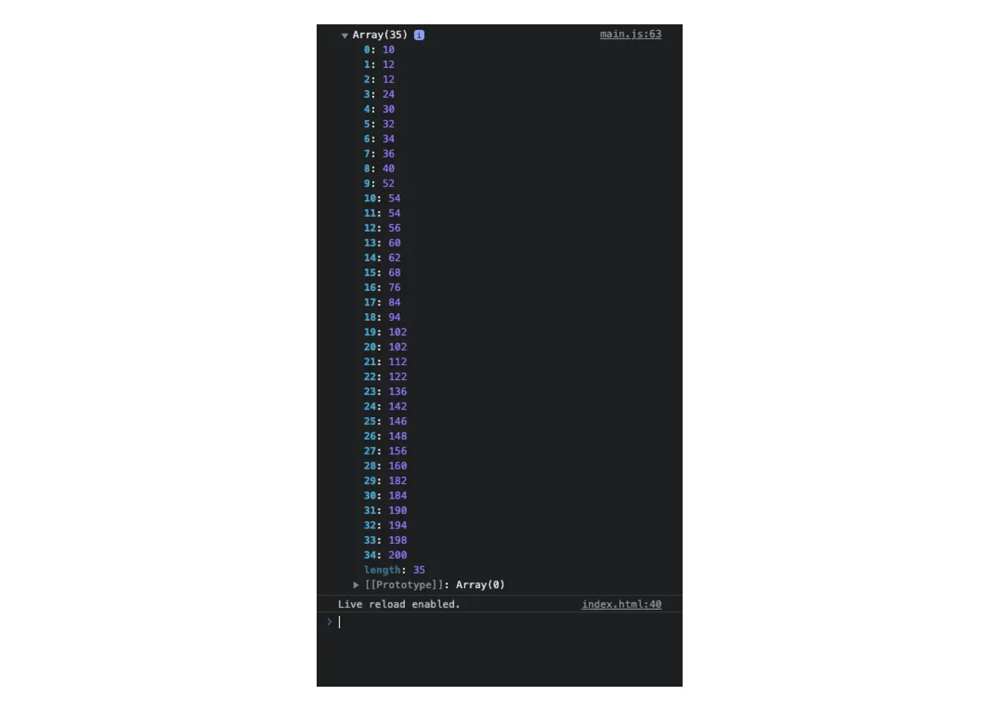

# Array-TS-Level-12 (split)
## Task
- Learning objective: After this exercise, you will understand the string method [split()](https://developer.mozilla.org/en-US/docs/Web/JavaScript/Reference/Global%5FObjects/String/split?retiredLocale=de) and be able to use it.
- Now we will look at a string method that returns an array. That's why split() is always covered first in arrays. With split(), you can create an array from a string. You can specify how the string should be split in the () brackets of split().
- Use the following string as an example:
    
    - const futuramaQuote = “It's okay, Bender. I like cooking too. Oh, you're a dollar naughtier than most. My fellow Earthicans, as I have explained in my book ‘Earth in the Balance’, and the much more popular ‘Harry Potter and the Balance of Earth’, we need to defend our planet against pollution. Also dark wizards.”
    
- Use the result preview in the browser console to find out where the string has been split
- It is important that you temporarily store the individual processes in extra variables, because otherwise you will not be able to continue working with the return value of split()


# Array-TS-Level-13 (includes)
# Task
- Learning objective: After this exercise, you will be able to search for substrings using the includes() method
- Use the [includes()](https://developer.mozilla.org/en-US/docs/Web/JavaScript/Reference/Global_Objects/Array/includes?retiredLocale=de) method to find out whether the substring you are looking for is present in the string
- When searching for “Piper” and “piper,” you will see that the includes() method is case sensitive. Therefore, use another method to work around this
- The method also allows you to search from a specific index. To do this, display the search for “peck”; the result in the console should be true once and false once

```jsx
const string: string = "Peter Piper picked a peck of pickled peppers. How many pickled peppers did Peter Piper pick?";
```

# Array-TS-Level-14 (reverse)
- **Learning goal:** After this exercise, you will be able to create a function that processes strings, uses methods to transform and manipulate strings and arrays, and reverses arbitrary words or sentences.
- Write a small program that reverses strings.
- This function should be able to reverse any string passed to it as a parameter.
- You will need to use array methods to reverse the string.
- Call the function using your name as a parameter.
- Check the result in the console.
- Try reversing these words:
    - Sergio
    - Hannah
    - Racecar
    - Level
    - Kayak
- Try reversing these sentences:
    - Never odd or even
    - Was it a rat I saw
    - !edoc gnitirw peek ,taerg era uoY


# Array-TS-15 (sort + reverse)
# Task
- Learning objective: After this exercise, you will be able to use the sort() method to sort an array alphabetically
- Sort the programming languages alphabetically
- The code for the array is in the code snippet

```jsx
const languages: string[] = [
    "JavaScript",
    "Python",
    "Java",
    "Ruby",
    "PHP",
    "C++",
    "CSS",
    "C#",
    "Go",
    "C",
    "TypeScript",
    "Swift"
];
```

- Declare the function sortAlphabetically
- Use the sort() command to complete the task
- Call the sortAlphabetically function
- Check the result in the console
- Create another array called europeanCountries with a few countries, e.g.
France, Germany, Sweden, Great Britain, Czech Republic, Switzerland
- Call the sortAlphabetically function with the europeanCountries
- Check the result in the console

# Array-TS-16 (sort)
# Task
- Learning objective: After completing this exercise, you will understand how to use the sort() method to correctly sort an array of numbers (0 - 99) in ascending and descending order
- Sort the numbers from the array in the code snippet in ascending order

```jsx
const numArray1: number[] = [36, 24, 22, 3, 2, 98, 88, 99, 10, 54, 68, 70];
```

- Use the sort() command and take a closer look at this [documentation](https://developer.mozilla.org/en-US/docs/Web/JavaScript/Reference/Global_Objects/Array/sort?retiredLocale=de) to complete the task correctly
- Check the result in the console
- Then sort the numbers from the array in descending order
- Check the result in the console

# Array-TS-17 (sort)
# Task
- Learning objective: After completing this exercise, you will be able to sort a series of numbers in ascending order using the sort() method
- In this exercise, you will learn how to sort the numbers 0-∞ in ascending order
- Sort the numbers in ascending order
- The code is in the code snippet

```jsx
const numArray: number[] = [36, 324, 122, 62, 98, 88, 99, 1000];
```

- Use the [sort()](https://developer.mozilla.org/en-US/docs/Web/JavaScript/Reference/Global_Objects/Array/sort) command and Google to complete the task correctly
- Check the result in the console

# Array-TS-18 (Bonus)
## Task Description
- **Learning goal:** After this exercise, you will be able to search within arrays and process their contents.
- You are given two arrays of type `string`.
- **artworks**

```tsx
"Starry Night - Vincent van Gogh",
"Guernica - Pablo Picasso",
"The Birth of Venus - Sandro Botticelli",
"The Night Watch - Rembrandt",
"Mona Lisa - Leonardo da Vinci",
"The Potato Eaters - Vincent van Gogh",
"The Scream - Edvard Munch",
"The Last Supper - Leonardo da Vinci",
"The Annunciation - James Tissot",
"The Garden of Earthly Delights - Hieronymus Bosch"

```

- **artworkDates**

```tsx
"Starry Night - 1889",
"Guernica - 1937",
"The Birth of Venus - 1486",
"The Night Watch - 1642",
"Mona Lisa - 1503",
"The Potato Eaters - 1885",
"The Scream - 1893",
"The Last Supper - 1495",
"The Annunciation - 1885",
"The Garden of Earthly Delights - 1505"

```

---

- Write a function that receives a parameter called `artworkName`.
- The function should search for the given name in both `artworks` and `artworkDates`.

### Expected behavior

- If nothing is found, log the following message to the console:

```tsx
Artwork [artworkName] not found

```

- If a match is found, log the following sentence:

```tsx
"'Starry Night' was painted by Vincent van Gogh in the year 1889"

```

---

- Test the function with different values.

---

## ☝🏼 Hint
- Use the [`find()`](https://developer.mozilla.org/en-US/docs/Web/JavaScript/Reference/Global_Objects/Array/find) method to perform the search and research how it works.
- Use `split()` and `trim()` to extract the year and the name from the found results.

# Array-TS-19 (forEach)
# Task Description
- Learning objective: After completing this exercise, you will understand the functionality of [forEach()](https://www.w3schools.com/jsref/jsref%5Fforeach.asp).
- Write a function myDrinks() that outputs each element of an array to your console and think about how you can write the elements to your index.html
- Use the list from the code snippet and sort the array drinks alphabetically beforehand


# Array-TS-20 (map)
## Task Description
- **Learning goal:** After this exercise, you will understand the [`map()`](https://www.w3schools.com/jsref/jsref_map.asp) method and be able to use it.
- Use the following array:

```tsx
const drinks = [
'Coca-Cola',
'Apple Juice',
'Pepsi',
'Grape Juice',
'Sprite',
'Orange Juice',
'Red Bull Energy Drink',
'Fanta'
]

```

---

- Use the `map()` method to store all drinks in **uppercase letters** in a new variable called `upperDrinks`.
- Log `upperDrinks` to the console.
- Use the `map()` method to log the following sentence for each element:
    - `'I like [drink]'`

---

## ☝🏼 Hint

- You will need the following methods and keywords:
    - `toUpperCase()`
    - `map()`
    - `return`

---

## ✨ Bonus

- Move the transformation logic into a separate named function and use it instead of an inline arrow function.


# Array-TS-21
Task
- Learning objective: After completing this exercise, you will be able to transform array values and sort the results accordingly
- Each value from the array (see code snippet) should be multiplied by 2 and the result sorted

const array: number[] = [
    18, 16, 80, 51, 47, 38, 95, 42, 68, 61, 34, 51, 20, 17, 56, 31, 100, 6, 5, 30, 74, 97, 28, 99, 91, 27, 73, 12, 92, 6, 27, 71, 26, 15, 78
];


# Array-TS-22 (map)
Task
- Learning objective: After this exercise, you will have a deeper understanding of the map() method
- Write code that uses map() to convert an array of temperatures from Fahrenheit to Celsius
- Use the [mathematical formula](https://www.metric-conversions.org/de/temperatur/fahrenheit-in-celsius.htm) celsius = (℉ - 32) / 1.8 for the conversion
- Use the array from the code snippet
- Check the result in the console

# Array-TS-23 (map)
# Task Description
- Learning objective: After completing this exercise, you will be able to use the array method map() to transform elements based on a condition
- Use the variable checkNumber from the code snippet
- Use the array method map()
- The following should happen in the map method:
    - Use an if statement to check whether the number is divisible by 3
- If yes: Add 100 to this number
- If no: Leave the number as it is
- The result of the map method should be stored in a new array
- Output the result to the console

# Array-TS-24 (map oder forEach)
# Task Description
- Learning objective: After this exercise, you will have deepened your understanding of how to use map() or forEach() to change file extensions.
- Create a new array of file names based on the given array (see code snippet).
- Remove the file extensions (e.g., “image.jpg” => “image”).
- If there is no file extension, the value “invalid” should be stored instead of the file name (e.g., ‘dog’ => “invalid”).
- The file names should be stored in lowercase letters.
- Either the map() or forEach() method should be used.

# Array-TS-25 (map)
# Task Description
- Learning objective: After this exercise, you will have a deeper understanding of how to use the [map()](https://developer.mozilla.org/en-US/docs/Web/JavaScript/Reference/Global_Objects/Array/map?retiredLocale=de) method.
- Use the array of emojis from the code snippet.
- Write code that turns each fruit from the fruits array into fruit juice by adding a juice glass
- Now output the fruit juices in the console

# Array-TS-26 (filter)
# Task Description
- Learning objective: After this exercise, you will have a deeper understanding of how to use the [filter()](https://www.w3schools.com/jsref/jsref%5Ffilter.asp) method.
- Use the array of numbers from 1 to 10 from the code snippet.
- Write a function printEvenNumbers(), where the elements are selected by a Boolean query that only shows us the even numbers
- Write a function printOddNumbers(), where the elements are selected by a Boolean query that only shows us the odd numbers
- Use both functions to call the filter method
- The result should be two arrays:
    - evenNumbers
- oddNumbers
- Check the functionality
- Now write the same logic again in arrow function notation


# Array-TS-27 (Bonus)
## Task Description — Meal Planner
- **Learning goal:**
    
    After this exercise, you will be able to:
    
    - work with multiple arrays
    - handle user input and events
    - dynamically render elements in the DOM
    - add and remove items from arrays
    - connect TypeScript logic with HTML elements

---

### Given

You are building a **Meal Planner** application.

- The application contains:
    - an input field where users can enter a meal name
    - a button to add the meal
    - a select dropdown to choose a week
    - an overview section where meals are displayed
- You will work with **four arrays**, one for each week:
    - `week1`
    - `week2`
    - `week3`
    - `week4`

Each array stores meal names as strings.

---

### Requirements

1. **Add meals**
    - When the user enters a meal name and clicks the **Add Meal** button:
        - If the input field is empty, log a message to the console.
        - Otherwise, add the meal to the array of the selected week.
2. **Select week**
    - Use a `<select>` element to choose between:
        - Week 1
        - Week 2
        - Week 3
        - Week 4
    - When the selected week changes, update the displayed meals accordingly.
3. **Display meals**
    - Render all meals of the selected week dynamically into the HTML.
    - Each meal should be displayed inside its own container.
4. **Delete meals**
    - Each displayed meal should have a delete button.
    - When the delete button is clicked:
        - Remove the meal from the corresponding array.
        - Remove the meal from the DOM.
5. **Reset input**
    - After adding a meal successfully, clear the input field.

---

### Functional Structure (Guidance)

- Create a function that:
    - decides **which week array** should be used based on the selected value.
- Create a function that:
    - renders a given week array into the HTML.
- Create a function that:
    - removes an item from a week array and updates the UI.

---

### ☝🏼 Hint

You will need to use:

- `querySelector`
- `addEventListener`
- `switch`
- `push()`
- `splice()`
- `forEach()`
- DOM methods like:
    - `createElement`
    - `appendChild`
    - `innerHTML`

---

## ✨ Bonus
- Extract logic into **separate, well-named functions** instead of writing everything inline.
- Make sure your application updates correctly when:
    - switching weeks
    - adding meals
    - deleting meals