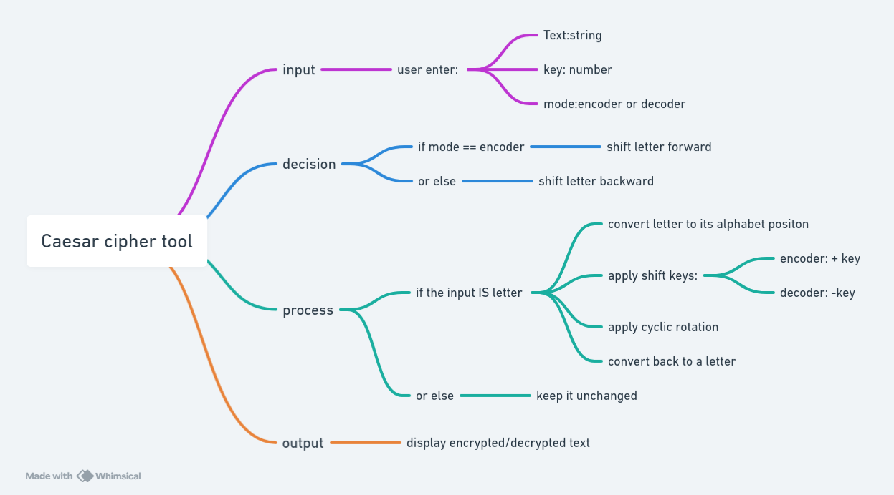

# Project-TS-Caesar-Cipher

# Task Description

- We want to create an application that encrypts a text using the **Caesar cipher**.
- Create a **flowchart** (PAP diagram) to plan your solution. For support, you can use https://whimsical.com/.
- A text is entered.
- You can click **“encoder”** to encrypt the text.
- You can enter an already encrypted text and click **“decoder”** to decrypt it.
- In the **key** field, you can enter a number: the shift key.
- Here is the explanation of the encryption logic:

> The Caesar cipher is a simple symmetric encryption method based on monographic and monoalphabetic substitution. During encryption, each letter of the plaintext is mapped to a ciphertext letter. This mapping is created by shifting the characters of an ordered alphabet cyclically to the right by a fixed number of positions (rotating). “Cyclically” means that after Z you continue again at A. The number of shifted characters is the key, which remains the same for the entire encryption.

- The same idea in simpler words:

> **Encryption**: Take each letter in your text and shift it forward by a certain number of positions in the alphabet. For example, if you shift every letter by 3 positions, A becomes D, B becomes E, and so on. If you go past the end of the alphabet, you start again from the beginning (after Z comes A).

> **Decryption**: If you have the encrypted text, you can apply the same shift in the opposite direction to decrypt it. So if you shift each letter by 3 positions to the left (instead of to the right), you get the original text back.

- A simple example:
    - Original text: HELLO
    - Encrypted with key 1 (shift by 1 position): IFMMP
- Got it? Then create an HTML page with a form where users can choose between **encoding** and **decoding**.
- The form has **two inputs** (the string and the key) and **one output** (the encrypted/decrypted result).
- Create a flowchart and add it as an image to the project’s README.md.
- On [this page](https://www.boxentriq.com/ciphers/caesar-cipher) you can find an application that already implements the same logic.
- You can try different inputs there and look at the results.

